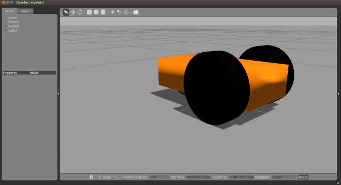

# mybot



## Blog

I have written a blog to describe the detailed procedures of making the robot from scratch, and below is the link

[Making my own Autonomous Robot in ROS / Gazebo, Day 3: Sense the world](http://www.cnblogs.com/casperwin/p/7605725.html)

## Instruction

#### Run the Models

Load the Gazebo simulator in a terminal

```
roslaunch mybot_gazebo mybot_world.launch
```

#### Enable the camera view

```
rosrun image_view image_view image:=/mybot/camera1/image_raw
```

#### Check in rviz

```
rosrun rviz rviz
```
At the bottom left of the window there is an “add” button which allows you to load visualization plugins. You can add in the robot model, the 3D transforms TF, the camera Image and the odometry by yourself.


## Reference

1. [Robotic simulation scenarios with Gazebo and ROS](http://www.generationrobots.com/blog/en/2015/02/robotic-simulation-scenarios-with-gazebo-and-ros/)
